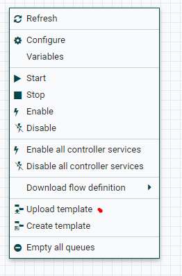
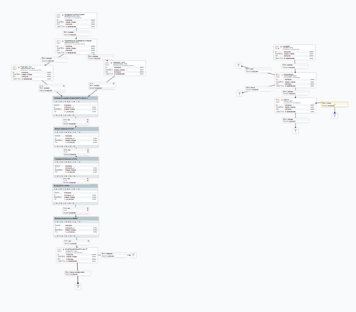
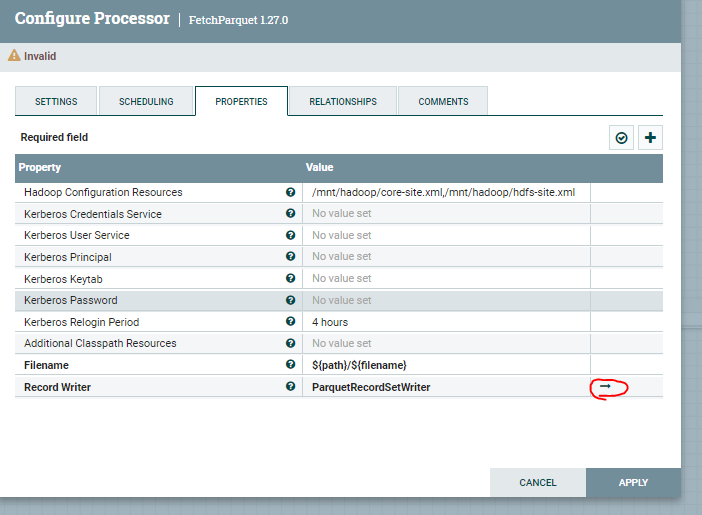
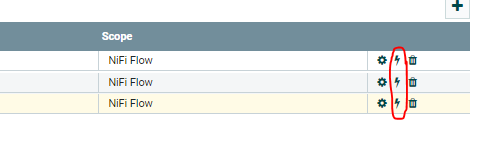
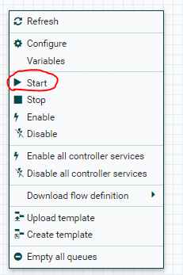
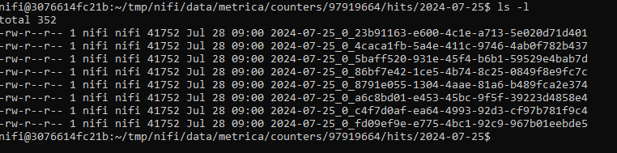

# Обработка данных и создание хранилища на основе Logs Api(Яндекс.Метрика) данных

## Задание проекта

Выгрузить данные из Logs API и на основе этих данныых организовать хранилище данных.

Используемые инструменты:

* Python v3.8
* AirFlow v2.8.2
* ClickHouse v23.8
* Docker v4.22.1

## Запуск

1. Заходим на сайт и регистрируемся
```
https://tilda.cc/ru/tpls/
```

2. Создаём любой сайт на основе шаблона и нажимаем опубликовать

3.Теперь необходимо зерегистрировать на Яндекс.Метрика и создать "счетчик" с сылкой на опубликованный сайт.

4. Чтобы Яндекс.Метрика начала считывать данные посещений и т.д., необходимо перейти на созданный сайт и подключить  тариф "Tilda Personal" (2 недели бесплатно никаких карт не требует)

5. На странице сайта заходим в Натройки сайта -> Аналитика -> в поле Яндекс.Метрика вводим номер счетчика, коотрый мы сделали и сохраняем. Если все получилось, можете полазить по сайту и через некоторое время в Яндекс.Метрике начнёт отображаться информация о посещения и т.д.

6. Теперь необходимо создать общего пользователя Яндекс ID для выдачи токена, переходим на сайт 
```
https://oauth.yandex.ru/client/new/
```
7. Выберете платформу **Веб-сервисы** и в поле **Redirect URI** пропишите:

```
https://oauth.yandex.ru/verification_code
```

8. В пункте **Доступ к данным** выберете(поключите) 2 пункта:

    а) metrika:write

    б) metrika:read

9. Нажимаем "Создать приложение"

10. Копирует ClientID и вставляем в ссылку
```
https://oauth.yandex.ru/authorize?response_type=token&client_id={ClientID}
```
11. Копируем токен и сохраняем его в отдельный файльк чтобы не забыть он нам еще понадобится

12. Скачиваем репозиторий с помощью команды:
```
git clone git@github.com:ShustGF/create_dwh_logs-api-yandex.git
```
13. Заходим в WSL, переходим в каталог с проектом и выполняем команду:
```
docker compose up -d
```
14. Заходим в браузер и в URL прописываем:
```
localhost:8181
```
Дождитесь окончания инициализации кластера NiFi.

15. После инициализации нажмите ПКМ и выберете ***Uplad template***



и выбетрите из каталога "Templates" файл "Выгрузка_данных_из_Logs_API_в_Hadoop.xml"

16. Подгружаем Template(в верхей части панели 2й элемент справа необходимо перетенуть на рабочий экран)

17. если все сделано правильно на экране появится следующий тракт



18. Теперь необходимо включить **Recorders**, для этого на правом тракте находим модуль "FetchParquet", заходим в него и в проследней строке нажимает на стрелочку



19. С правой стороны необходимо нажать на значки молнии во всех 3х строках.



20. Запускаем. ПКМ на пустое прокстансво и нажимаем "Start"



21. Если зайти в контейнер "nifi" c помощью команды 

```
docker exec -it nifi bash
```

и перейти в каталог

```
cd /home/nifi/tmp/nifi/data/metrica/counters/97919664//hits/2024-07-25/
```

и выполнить в нем команду 

```
ls -l
```

то можно увидеть файлы с данными.



Их можно считать, но по сути увидеть ничего не получится так как файлы сохранены в формате "parquet".